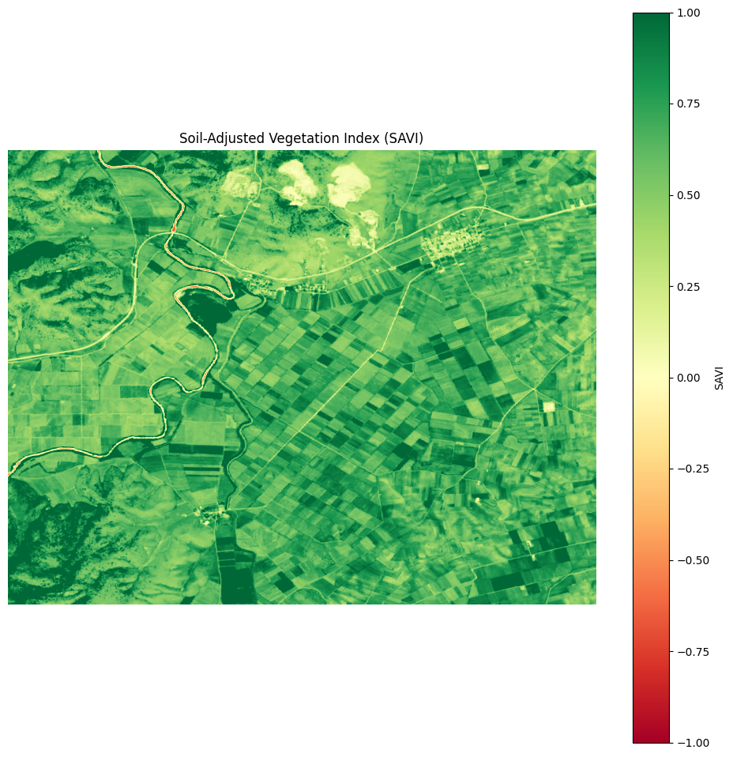
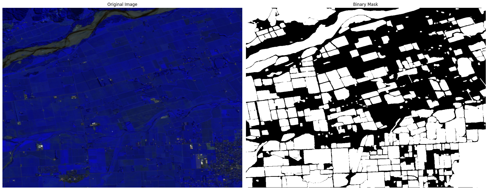

# Field Area Segmentation using SAM-HQ and NDVI

## Overview

This project serves as an example of how to approach to area segmentation using Segment Anything Model - High Quality (SAM-HQ). This implementation secured a position in the top 25 competitors in a field segmentation challenge (sentinel-2 images).

## Key Features

1. Utilizes SAM-HQ for image segmentation
2. Incorporates NDVI for enhanced vegetation detection
3. Processes multi-band satellite imagery (TIFF format)
4. Extracts and filters polygons based on customizable thresholds
5. Outputs results in JSON format

## Dependencies

- numpy
- os
- json
- shapely
- tifffile
- scikit-image
- tqdm
- segment_anything_hq

## Installation

1. Clone this repository
2. Install the required dependencies:
```pip install numpy shapely pandas tifffile scikit-image tqdm segment_anything_hq```
3. Download the SAM-HQ checkpoint file and place it in the `sam/` directory

## Usage

1. Place your input TIFF images in the `field_area_segmentation/test_images/images/` directory
2. Run the script:
```python sam.py```
3. The results will be saved in `results_base_b1_b2_ndvi.json`

## How it Works

1. **Image Processing**: The script reads multi-band TIFF images and extracts specific bands (1, 3, and 11) for processing.

2. **NDVI Calculation**: NDVI is calculated using the NIR (band 11) and Red (band 1) bands to highlight vegetation.

3. **Image Normalization**: A combined image using bands 1, 2, and NDVI is created and normalized.

4. **Segmentation**: SAM-HQ is used to generate segmentation masks on the normalized image.

5. **Polygon Extraction**: Contours are extracted from the segmentation masks and converted to polygons.

## Performance

This approach, combining SAM-HQ with NDVI secured me a position in the top 25 competitors, results could have been better if I had more time to fine-tune the parameters and combined
multiple other techniques/indexes.

Combination of channels 1, 3 and NDVI came about from grid search of different combinations of bands.

## Examples

Soil Adjusted Vegetation Index (SAVI) example from test set:

<div style="text-align: center;">
    
</div>


Segmentation example using chosen bands and NDVI:

<div style="text-align: center;">
    
</div>


## Competition link

- https://solafune.com/competitions/d91572d9-1680-4b9e-b372-25e71093f81a?menu=about&tab=overview
